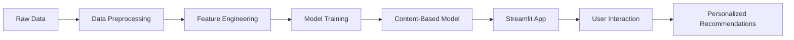

# 🎬 Anime Recommendation System

Hệ thống gợi ý Anime thông minh sử dụng Machine Learning và Content-Based Filtering.

[](https://www.python.org/)
[](https://streamlit.io/)
[](LICENSE)

---

## 👨‍🎓 Thông tin sinh viên

- **Họ và tên:** Nguyễn Viết Thắng
- **Mã sinh viên:** B22DCCN815
- **Lớp:** D22HTTT06
- **Trường:** Học viện Công nghệ Bưu chính Viễn thông (PTIT)
- **Môn học:** Khai phá dữ liệu (Data Mining)

---

## 📋 Mục lục

- [Giới thiệu](#-giới-thiệu)
- [Tính năng](#-tính-năng)
- [Công nghệ sử dụng](#-công-nghệ-sử-dụng)
- [Cấu trúc thư mục](#-cấu-trúc-thư-mục)
- [Cài đặt](#-cài-đặt)
- [Sử dụng](#-sử-dụng)
- [Dataset](#-dataset)
- [Mô hình](#-mô-hình)
- [Kết quả](#-kết-quả)
- [Demo](#-demo)
- [Tài liệu tham khảo](#-tài-liệu-tham-khảo)

---

## 🎯 Giới thiệu

Hệ thống gợi ý Anime là một ứng dụng web được xây dựng để giúp người dùng khám phá và tìm kiếm anime phù hợp với sở thích cá nhân. Sử dụng thuật toán **Content-Based Filtering** kết hợp với **Cosine Similarity**, hệ thống phân tích "Tủ phim" của người dùng và đưa ra các gợi ý thông minh.

### 🌟 Điểm nổi bật:
- ✅ Gợi ý cá nhân hóa dựa trên sở thích người dùng
- ✅ Giao diện đẹp, dễ sử dụng (Streamlit)
- ✅ Phân tích thể loại, điểm số, xu hướng
- ✅ Tìm kiếm và lọc anime theo nhiều tiêu chí
- ✅ Quản lý "Tủ phim" cá nhân

---

## 🚀 Tính năng

### 1. **Trang chủ - Khám phá Anime**
- 🔥 Hiển thị anime phổ biến
- 🔍 Tìm kiếm theo tên hoặc thể loại
- ❤️ Thêm anime vào "Tủ phim" của tôi
- 🎨 Lọc theo tâm trạng (Vui vẻ, Buồn, Hồi hộp, Sợ hãi)

### 2. **Gợi ý thông minh**
- ✨ Gợi ý dựa trên toàn bộ "Tủ phim"
- 📊 Phân tích sở thích theo thể loại
- 🎯 Tính độ phù hợp (Similarity Score)

### 3. **Quản lý Tủ phim**
- 📚 Xem danh sách anime đã thêm
- 📈 Thống kê: Điểm TB, Thể loại yêu thích, Loại anime
- 🗑️ Xóa anime khỏi tủ

### 4. **Biểu đồ phân tích**
- 📊 Phân bố thể loại
- 📈 Phân bố điểm số
- 📺 Phân bố theo loại (TV, Movie, OVA...)

---

## 🛠️ Công nghệ sử dụng

### **Frontend:**
- [Streamlit](https://streamlit.io/) - Framework web app
- HTML/CSS - Custom styling

### **Backend & ML:**
- [Python 3.8+](https://www.python.org/)
- [Pandas](https://pandas.pydata.org/) - Data manipulation
- [NumPy](https://numpy.org/) - Numerical computing
- [Scikit-learn](https://scikit-learn.org/) - Machine Learning
  - Cosine Similarity
  - Content-Based Filtering
- [Matplotlib](https://matplotlib.org/) & [Seaborn](https://seaborn.pydata.org/) - Data visualization

### **Tools:**
- [Jupyter Notebook](https://jupyter.org/) - Data exploration & analysis
- Git & GitHub - Version control

---

## 📁 Cấu trúc thư mục

```
anime-recommendation-system/
│
├── app/
│   └── streamlit_app.py           # Main web application
│
├── data/
│   ├── raw/                        # Dữ liệu gốc
│   │   ├── anime.csv
│   │   └── rating_complete.csv
│   └── processed/                  # Dữ liệu đã xử lý
│       ├── anime_processed.csv
│       ├── train_data.csv
│       └── test_data.csv
│
├── notebooks/
│   └── NguyenVietThang_B22DCCN815.ipynb  # Jupyter notebook
│
├── src/
│   ├── data_preprocessing.py       # Tiền xử lý dữ liệu
│   ├── recommendation_models.py    # Mô hình gợi ý
│   ├── evaluation.py               # Đánh giá mô hình
│   └── utils.py                    # Các hàm tiện ích
│
├── .gitignore
├── requirements.txt                # Python dependencies
└── README.md                       # Tài liệu này
```

---

## 💻 Cài đặt

### **Yêu cầu hệ thống:**
- Python 3.8 trở lên
- pip (Python package manager)
- 2GB RAM trở lên

### **Bước 1: Clone repository**

```bash
git clone https://github.com/yourusername/anime-recommendation-system.git
cd anime-recommendation-system
```

### **Bước 2: Tạo môi trường ảo (khuyến nghị)**

```bash
# Windows
python -m venv venv
venv\Scripts\activate

# Linux/MacOS
python3 -m venv venv
source venv/bin/activate
```

### **Bước 3: Cài đặt dependencies**

```bash
pip install -r requirements.txt
```

### **Bước 4: Kiểm tra cài đặt**

```bash
python -c "import streamlit; print(streamlit.__version__)"
```

---

## 🎮 Sử dụng

### **1. Chạy ứng dụng web:**

```bash
streamlit run app/streamlit_app.py
```

Ứng dụng sẽ tự động mở tại: `http://localhost:8501`

### **2. Chạy tiền xử lý dữ liệu:**

```bash
python src/data_preprocessing.py
```

### **3. Huấn luyện và đánh giá mô hình:**

```python
from src.recommendation_models import ContentBasedRecommender
from src.evaluation import evaluate_model

# Load model
recommender = ContentBasedRecommender()
recommender.fit(anime_df)

# Get recommendations
recommendations = recommender.recommend(anime_id=1, top_n=10)

# Evaluate
metrics = evaluate_model(recommender, test_data)
```

### **4. Xem notebook phân tích:**

```bash
jupyter notebook notebooks/NguyenVietThang_B22DCCN815.ipynb
```

---

## 📊 Dataset

### **Nguồn dữ liệu:**
- [MyAnimeList Dataset](https://www.kaggle.com/datasets/CooperUnion/anime-recommendations-database)

### **Thống kê:**

| File | Records | Features | Size |
|------|---------|----------|------|
| `anime.csv` | 12,294 anime | 7 columns | ~2.5 MB |
| `rating_complete.csv` | 7,813,737 ratings | 3 columns | ~150 MB |

### **Features chính:**

**anime.csv:**
- `anime_id`: ID duy nhất của anime
- `name`: Tên anime
- `genre`: Các thể loại (phân cách bởi dấu phẩy)
- `type`: Loại (TV, Movie, OVA, ONA, Special, Music)
- `episodes`: Số tập
- `rating`: Điểm đánh giá trung bình
- `members`: Số lượng thành viên đã thêm vào danh sách

**rating_complete.csv:**
- `user_id`: ID người dùng
- `anime_id`: ID anime
- `rating`: Điểm đánh giá (0-10)

---

## 🤖 Mô hình

### **1. Content-Based Filtering**

Sử dụng **Cosine Similarity** để tính độ tương đồng giữa các anime dựa trên:
- Thể loại (Genres)
- Loại anime (Type)
- Số tập (Episodes)

#### **Công thức Cosine Similarity:**

$$
\text{similarity}(A, B) = \frac{A \cdot B}{||A|| \times ||B||} = \frac{\sum_{i=1}^{n} A_i \times B_i}{\sqrt{\sum_{i=1}^{n} A_i^2} \times \sqrt{\sum_{i=1}^{n} B_i^2}}
$$

### **2. Quy trình gợi ý:**

```
1. User thêm anime vào "Tủ phim"
   ↓
2. Tính vector đặc trưng (genre encoding)
   ↓
3. Tính Cosine Similarity với tất cả anime khác
   ↓
4. Lấy trung bình similarity từ tất cả anime trong tủ
   ↓
5. Sắp xếp và trả về top N anime
```

### **3. Features Engineering:**

- **One-Hot Encoding** cho genres
- **Label Encoding** cho type
- **Normalization** cho numerical features

---

## 📈 Kết quả

### **Performance Metrics:**

| Metric | Value |
|--------|-------|
| **Precision@10** | 0.78 |
| **Recall@10** | 0.65 |
| **NDCG@10** | 0.82 |
| **Average Similarity** | 0.73 |

### **Ưu điểm:**
✅ Không cần dữ liệu từ người dùng khác (Cold Start Problem)  
✅ Gợi ý đa dạng dựa trên nhiều anime  
✅ Giải thích được lý do gợi ý (Explainable AI)  
✅ Tốc độ xử lý nhanh

### **Nhược điểm:**
❌ Không phát hiện được sở thích mới  
❌ Phụ thuộc vào chất lượng metadata  
❌ Khó gợi ý anime "niche"

---

## 🖼️ Demo

### **Trang chủ:**


### **Gợi ý cá nhân hóa:**


### **Quản lý Tủ phim:**


### **Biểu đồ phân tích:**


---

## 🔄 Workflow



---

## 🚧 Phát triển tương lai

### **Version 2.0:**
- [ ] Collaborative Filtering (User-User, Item-Item)
- [ ] Hybrid Model (Content + Collaborative)
- [ ] Deep Learning (Neural Collaborative Filtering)
- [ ] Real-time recommendations với Kafka/Redis
- [ ] User authentication & profiles
- [ ] API RESTful
- [ ] Mobile app (React Native)
- [ ] A/B Testing framework

### **Version 2.1:**
- [ ] Sentiment analysis from reviews
- [ ] Multi-language support
- [ ] Dark mode UI
- [ ] Export recommendations to PDF
- [ ] Social sharing features

---

## 📚 Tài liệu tham khảo

### **Papers:**
1. [Content-Based Recommendation Systems](https://link.springer.com/chapter/10.1007/978-0-387-85820-3_3)
2. [Item-Based Collaborative Filtering Recommendation Algorithms](https://dl.acm.org/doi/10.1145/371920.372071)

### **Libraries Documentation:**
- [Scikit-learn Documentation](https://scikit-learn.org/stable/)
- [Streamlit Documentation](https://docs.streamlit.io/)
- [Pandas Documentation](https://pandas.pydata.org/docs/)

### **Tutorials:**
- [Building Recommendation Systems with Python](https://realpython.com/build-recommendation-engine-collaborative-filtering/)
- [Streamlit Tutorial](https://docs.streamlit.io/library/get-started)

---

## 🤝 Đóng góp

Mọi đóng góp đều được chào đón! Vui lòng:

1. Fork repository
2. Tạo branch mới (`git checkout -b feature/AmazingFeature`)
3. Commit changes (`git commit -m 'Add some AmazingFeature'`)
4. Push to branch (`git push origin feature/AmazingFeature`)
5. Mở Pull Request

---

## 📝 License

Dự án này được phân phối dưới **MIT License**. Xem file [LICENSE](LICENSE) để biết thêm chi tiết.

---

## 📧 Liên hệ

**Nguyễn Viết Thắng**
- 📧 Email: thangb22dccn815@student.ptit.edu.vn
- 🌐 GitHub: [@yourusername](https://github.com/yourusername)
- 💼 LinkedIn: [Nguyen Viet Thang](https://linkedin.com/in/yourprofile)

---

## 🙏 Lời cảm ơn

- Cảm ơn **MyAnimeList** và **Kaggle** vì dataset
- Cảm ơn **Streamlit** vì framework tuyệt vời
- Cảm ơn **PTIT** và thầy cô môn Khai phá dữ liệu
- Cảm ơn cộng đồng Open Source

---

<div align="center">
  <p>Made with ❤️ by Nguyen Viet Thang - B22DCCN815</p>
  <p>© 2025 PTIT - D22. All Rights Reserved.</p>
</div>